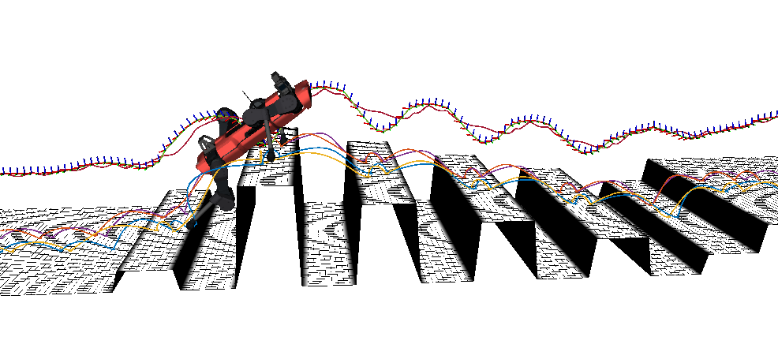
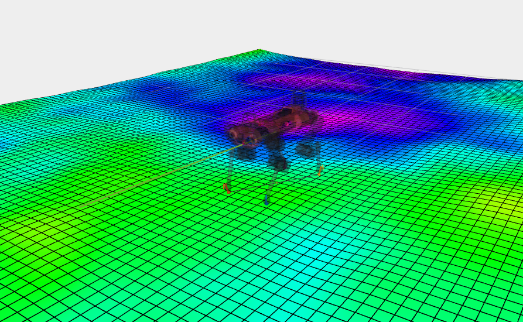

# OCS2_ROS2 Toolbox

## 1. Summary

OCS2_ROS2 is developed based on [OCS2](https://github.com/leggedrobotics/ocs2), it was refactored to be compatible with ROS2 and modern cmake.

### What's New (2026.05)

**ROS 2 Lyrical Support**
- Add support for ROS 2 Lyrical on Ubuntu 26.04.
- Modernize launch files for newer `robot_state_publisher`: URDF files are now parsed and passed through the `robot_description` parameter instead of the removed positional URDF path argument.
- Replace deprecated `tf2` / `tf2_ros` `.h` includes with `.hpp` headers for Jazzy and Lyrical compatibility.
- Remove dependency on the removed `urdf::exportURDF` API by keeping the original URDF XML inside the Pinocchio interface.
- Make RViz plugins select the matching Qt major version automatically (`Qt5` on Jazzy, `Qt6` on Lyrical).
- Avoid OctoMap ABI conflicts by letting the collision backend own its native OctoMap linkage.
- Default launch terminal prefix is now `xterm -e`, which works better in WSL and container environments such as distrobox. Override it with `OCS2_TERMINAL_PREFIX` if needed.

### What's New (2026.01)

**Environment Collision for Mobile Manipulator**
- Add basic geometry environment collision support.
- Please check Franka demo for more details.

### Tested Platform

* Intel Nuc X15 (i7-11800H):
    * Ubuntu 22.04 ROS2 Humble  (WSL2 included)
    * Ubuntu 24.04 ROS2 Jazzy   (WSL2 included)
    * Ubuntu 26.04 ROS2 Lyrical (distrobox)
* Lenovo P16v (i7-13800H):
    * Ubuntu 24.04 ROS2 Jazzy
* Jetson Orin Nano
    * Ubuntu 22.04 ROS2 Humble (JetPack 6.1)

## 2. Installation

### 2.1 Prerequisites

The OCS2 library is written in C++17. It is tested under Ubuntu with library versions as provided in the package
sources.

Tested system and ROS2 version:

* Ubuntu 26.04 ROS2 Lyrical
* Ubuntu 24.04 ROS2 Jazzy
* Ubuntu 22.04 ROS2 Humble

> **Note:** Some demos open auxiliary nodes in a new terminal. The default terminal prefix is `xterm -e`
> for better compatibility with WSL and distrobox. Install it if necessary:
> ```bash
> sudo apt install xterm
> ```
> You can override the terminal prefix, for example:
> ```bash
> export OCS2_TERMINAL_PREFIX="gnome-terminal --"
> ```

### 2.2 Dependencies

* C++ compiler with C++17 support
* Eigen (v3.4)
* Boost C++ (v1.74)

> **Note:** Latest version used pinocchio from ros source to simplified install steps. If you install pinocchio from robot-pkgs, you can uninstall it by
> ```bash
> sudo apt remove robotpkg-*
> ```

### 2.3 Clone Repositories

* Create a new workspace or clone the project to your workspace

```bash
cd ~
mkdir -p ros2_ws/src
```

* Clone the repository

```bash
cd ~/ros2_ws/src
git clone https://github.com/legubiao/ocs2_ros2
cd ocs2_ros2
git submodule update --init --recursive
```

* rosdep

```bash
cd ~/ros2_ws
rosdep install --from-paths src --ignore-src -r -y
```

## 3. Basic Examples

This section contains basic examples for the OCS2 library.

### 3.1 [Double Integrator](https://leggedrobotics.github.io/ocs2/robotic_examples.html#double-integrator)

<details>
<summary>🎯 Click to expand Double Integrator example</summary>

* build
```bash
cd ~/ros2_ws
colcon build --packages-up-to ocs2_double_integrator_ros --symlink-install
```
* run
```bash
source ~/ros2_ws/install/setup.bash
ros2 launch ocs2_double_integrator_ros double_integrator.launch.py
```

https://github.com/user-attachments/assets/581d03ff-43e4-49c9-8f47-a0ce491b585c

</details>

### 3.2 [Cartpole](https://leggedrobotics.github.io/ocs2/robotic_examples.html#cartpole)

<details>
<summary>🛒 Click to expand Cartpole example</summary>

* build
```bash
cd ~/ros2_ws
colcon build --packages-up-to ocs2_cartpole_ros --symlink-install
```
* run
```bash
source ~/ros2_ws/install/setup.bash
ros2 launch ocs2_cartpole_ros cartpole.launch.py
```

https://github.com/user-attachments/assets/7fe0fe18-3ad5-47dd-9fe2-be90413c2f2f

</details>

### 3.3 [Ballbot](https://leggedrobotics.github.io/ocs2/robotic_examples.html#ballbot)

<details>
<summary>🏀 Click to expand Ballbot example</summary>

* build
```bash
cd ~/ros2_ws
colcon build --packages-up-to ocs2_ballbot_ros --symlink-install
```
* run
```bash
source ~/ros2_ws/install/setup.bash
ros2 launch ocs2_ballbot_ros ballbot_ddp.launch.py
```

https://github.com/user-attachments/assets/c87966b8-525f-4592-a54f-cfaed458a6f2

</details>

### 3.4 [Quadrotor](https://leggedrobotics.github.io/ocs2/robotic_examples.html#quadrotor)

<details>
<summary>🚁 Click to expand Quadrotor example</summary>

* build
```bash
cd ~/ros2_ws
colcon build --packages-up-to ocs2_quadrotor_ros --symlink-install
```
* run
```bash
source ~/ros2_ws/install/setup.bash
ros2 launch ocs2_quadrotor_ros quadrotor.launch.py
```

https://github.com/user-attachments/assets/aed3173f-a6e6-4499-ae8c-d101bedc5222

</details>

### 3.5 [Mobile Manipulator](https://leggedrobotics.github.io/ocs2/robotic_examples.html#mobile-manipulator)

<details>
<summary>🦾 Click to expand Mobile Manipulator example</summary>

* build
```bash
cd ~/ros2_ws
colcon build --packages-up-to ocs2_mobile_manipulator_ros --symlink-install
```
* run Mabi-Mobile
```bash
source ~/ros2_ws/install/setup.bash
ros2 launch ocs2_mobile_manipulator_ros manipulator_mabi_mobile.launch.py
```

https://github.com/user-attachments/assets/c71f6123-fa3a-4b72-a60f-5509b8c25413

* run Kinova Jaco2
```bash
source ~/ros2_ws/install/setup.bash
ros2 launch ocs2_mobile_manipulator_ros manipulator_kinova_j2n6.launch.py
```
* run Franka Panda
```bash
source ~/ros2_ws/install/setup.bash
ros2 launch ocs2_mobile_manipulator_ros franka.launch.py
```

```bash
source ~/ros2_ws/install/setup.bash
ros2 launch ocs2_mobile_manipulator_ros franka_sqp.launch.py
```

https://github.com/user-attachments/assets/bab14b46-486e-46dc-a268-bd63616d1010

* run Willow Garage PR2
```bash
source ~/ros2_ws/install/setup.bash
ros2 launch ocs2_mobile_manipulator_ros pr2.launch.py
```

https://github.com/user-attachments/assets/100aae62-9e80-487b-89cf-ea6a97ef2505

* run Clearpath Ridgeback with UR-5
```bash
source ~/ros2_ws/install/setup.bash
ros2 launch ocs2_mobile_manipulator_ros manipulator_ridgeback_ur5.launch.py 
```

</details>

### 3.6 [Legged Robot](https://leggedrobotics.github.io/ocs2/robotic_examples.html#legged-robot)

<details>
<summary>🐕 Click to expand Legged Robot example</summary>

* build
```bash
cd ~/ros2_ws
colcon build --packages-up-to ocs2_legged_robot_ros --symlink-install
```
* run
```bash
source ~/ros2_ws/install/setup.bash
ros2 launch ocs2_legged_robot_ros legged_robot_ddp.launch.py
```

https://github.com/user-attachments/assets/d29551b7-2ac7-428d-9605-f782193bcaf2

</details>

## 4. Advanced Examples

[](https://www.bilibili.com/video/BV1gSHLe3EEv/)

### 4.1 [Perceptive Locomotion](advance%20examples/ocs2_perceptive_anymal/)




### 4.2 [RaiSim Simulation](advance%20examples/ocs2_raisim/)




### 4.3 [MPC-Net](advance%20examples/ocs2_mpcnet/)

## 5. Related Projects

* [quadruped ros2 control](https://github.com/legubiao/quadruped_ros2_control)： Quadruped controller based on OCS2 ROS2
* [arms ro2 control](https://github.com/fiveages-sim/arms_ros2_control): Mobile manipulator controller based on OCS2 ROS2
* [robot_descriptions](https://github.com/fiveages-sim/robot_descriptions): More robot configs for OCS2 ROS2